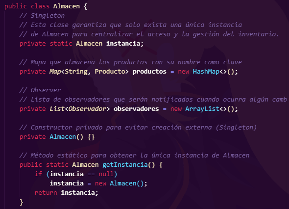
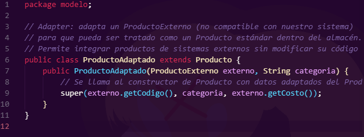
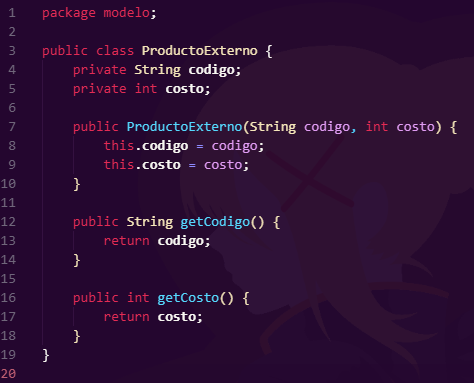
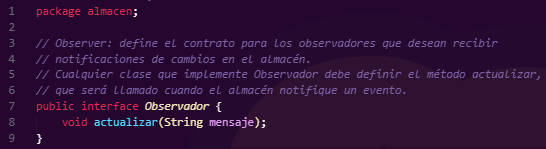
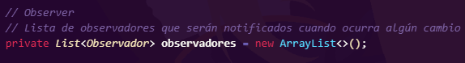
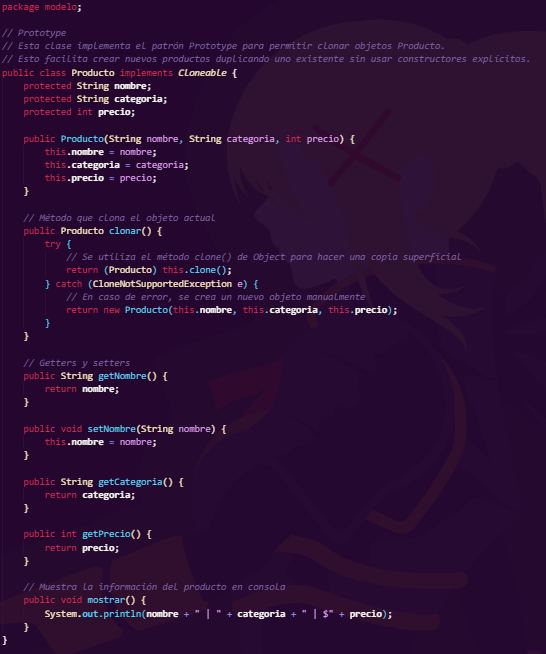
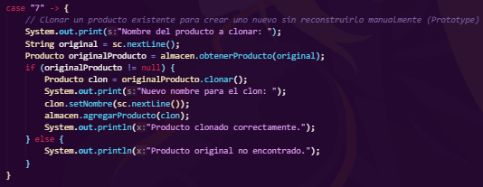

# CRUD de Almacén con Patrones de Diseño GoF

**Autor:** Vicente Lizana Farías
**Fecha:** Junio 2025

---

## Introducción

En el desarrollo de software orientado a objetos, los **patrones de diseño** propuestos por la *Gang of Four (GoF)* constituyen un conjunto de soluciones estandarizadas a problemas comunes que enfrentan los desarrolladores durante la implementación de sistemas robustos, escalables y mantenibles.

Este proyecto consiste en la implementación de una aplicación de consola en **Java estándar** que simula un sistema CRUD para la gestión de productos dentro de un almacén. La principal finalidad es demostrar el uso práctico de **cuatro patrones de diseño GoF** aplicados de manera coherente y justificada, en un contexto funcional y comprensible.

Cada patrón fue cuidadosamente seleccionado para resolver necesidades específicas del sistema: desde la centralización del acceso al inventario, hasta la capacidad de adaptación e integración con otros sistemas. El resultado es una aplicación estructurada, flexible y fácil de extender o mantener.

---

## Desarrollo

### Descripción general del sistema

El sistema desarrollado permite la gestión de productos en un almacén virtual mediante una interfaz de línea de comandos (CLI). A través de un menú interactivo, el usuario puede realizar operaciones básicas como agregar, actualizar, eliminar, clonar y visualizar productos. También es posible integrar productos provenientes de fuentes externas y recibir notificaciones automáticas sobre los cambios realizados.

El programa está dividido en paquetes según su responsabilidad (`modelo`, `almacen`, `adaptador`, etc.), y se enfoca en mantener una arquitectura clara, coherente y alineada con los principios de diseño orientado a objetos.

Se ha reservado una carpeta `/img` para incluir diagramas UML, capturas de pantalla del sistema y otros recursos gráficos de apoyo para la documentación o defensa del proyecto.

---

### Patrones de diseño utilizados

A continuación, se describen los cuatro patrones de diseño implementados, incluyendo el problema que resuelven, su implementación y su justificación dentro del sistema.

#### 1. Singleton (Patrón Creacional)

**Ubicación:** Clase `Almacen`.

**Problema resuelto:** En sistemas que gestionan recursos compartidos (como una base de datos o un almacén), es fundamental garantizar que solo exista una única instancia del objeto central. Múltiples instancias podrían producir duplicación de datos, inconsistencias o errores de sincronización.

**Implementación:** Se define un constructor privado y un método estático `getInstancia()` que retorna siempre la misma instancia única del almacén.

**Justificación:** Centralizar el acceso al inventario asegura la coherencia del sistema. Todas las operaciones CRUD se realizan sobre la misma fuente de datos, simplificando la lógica y evitando problemas de concurrencia o duplicidad.



#### 2. Adapter (Patrón Estructural)

**Ubicación:** Clases `ProductoExterno` (incompatible) y `ProductoAdaptado`.

**Problema resuelto:** En muchos sistemas reales, los datos o productos no siempre provienen del mismo origen. Cuando se reciben objetos que no cumplen con la estructura esperada, es necesario adaptarlos sin modificar el código fuente original.

**Implementación:** `ProductoAdaptado` hereda de `Producto` y toma como argumento un objeto `ProductoExterno`, transformando sus atributos a la estructura utilizada internamente.

**Justificación:** Este patrón permite que el sistema sea extensible e interoperable con otros sistemas externos. La integración de productos externos se realiza sin alterar la clase base, cumpliendo con el principio abierto/cerrado (OCP) de SOLID.





#### 3. Observer (Patrón de Comportamiento)

**Ubicación:** Interfaz `Observador` y clase `Almacen`.

**Problema resuelto:** En un sistema donde múltiples componentes necesitan reaccionar a eventos (como logs, interfaces, auditorías o notificaciones), es fundamental una forma de comunicar los cambios sin acoplar directamente los componentes entre sí.

**Implementación:** `Almacen` mantiene una lista de observadores, los cuales son notificados automáticamente mediante el método `actualizar(String mensaje)` cada vez que se produce una modificación en el inventario.

**Justificación:** El patrón Observer mejora la escalabilidad y el desacoplamiento. Nuevos observadores pueden añadirse fácilmente sin modificar la lógica interna del almacén. Actualmente, se utiliza para mostrar mensajes en consola, pero puede ampliarse para enviar correos, actualizar interfaces gráficas, etc.





#### 4. Prototype (Libre elección)

**Ubicación:** Clase `Producto` y opción 7 del menú en `App.java`.

**Problema resuelto:** A veces se requiere crear una nueva instancia de un objeto que es casi idéntico a uno ya existente. Hacerlo manualmente sería redundante y propenso a errores.

**Implementación:** La clase `Producto` implementa `Cloneable` e incluye el método `clonar()`, que crea y devuelve una copia exacta del producto.

**Justificación:** Este patrón facilita la reutilización de objetos existentes, especialmente cuando se trabaja con plantillas o productos con estructuras similares. En el sistema, el usuario puede clonar un producto y luego editar su nombre, lo que reduce el tiempo y errores en la creación de productos repetitivos.





---

## Conclusión

El desarrollo de esta aplicación CRUD no solo tiene valor funcional, sino que también evidencia cómo los **patrones de diseño GoF pueden aplicarse de forma práctica** incluso en sistemas relativamente simples. Lejos de ser un lujo arquitectónico, los patrones permiten:

* Centralizar el control de objetos compartidos (Singleton).
* Adaptar clases incompatibles sin modificar su código (Adapter).
* Desacoplar emisores y receptores de eventos (Observer).
* Clonar objetos complejos de forma eficiente (Prototype).

El uso de estos patrones en conjunto mejora la calidad del software, haciéndolo más mantenible, reutilizable y adaptable. Además, prepara la base para futuras mejoras como la persistencia en base de datos, interfaces gráficas o servicios web.

---

## Instrucciones de compilación y ejecución

### Requisitos

* Java Development Kit (JDK) versión 17 o superior
* Consola o terminal de comandos
* Visual Studio Code (opcional, pero recomendado)

### Compilación

Desde la raíz del proyecto, ejecuta el siguiente comando en la terminal:

```bash
javac -d bin src/**/*.java
```

Este comando compilará todo el código fuente desde `src/` y generará los `.class` en la carpeta `bin/`.

### Ejecución

Para iniciar el programa, en el entorno que se preparo el programa (Visual Studio Code), se recomienda que se seleccione con el click derecho del mouse o touchpad el archivo **App.java** y seleccionar la opción **Run Java**. Esta es la opción más facil para poder iniciarlo, a fin de cuentas, se busca la comodidad del usuario.
